# Flow of Work & System Interconnections: Arabian Chick, N

> **Project:** Arabian Chick, N — Fast Food & Pizza Restaurant Web Platform  
> **Purpose:** Exhaustive breakdown of component-to-component connections, data pipelines, event buses, state management, and end-to-end workflows.  
> **Document Status:** Active & Production-Aligned  

---

## Table of Contents
1. [Executive Interconnection Map](#1-executive-interconnection-map)
2. [Global Architecture & Connection Graph](#2-global-architecture--connection-graph)
3. [Frontend Interconnections & Wiring](#3-frontend-interconnections--wiring)
   - [Tree Hierarchy & Component Relationships](#tree-hierarchy--component-relationships)
   - [The Cart State Bus (`CartContext`)](#the-cart-state-bus-cartcontext)
   - [The Data Ingestion Bus (`useMenuData`)](#the-data-ingestion-bus-usemenudata)
   - [Search & Navigation Interconnection (`SearchBox` & Scrollspy)](#search--navigation-interconnection-searchbox--scrollspy)
   - [Image Resolution Pipeline (`SmartImage`)](#image-resolution-pipeline-smartimage)
4. [Backend & Database Interconnections](#4-backend--database-interconnections)
   - [Express Request Pipeline](#express-request-pipeline)
   - [Security & Authentication Interconnection](#security--authentication-interconnection)
   - [Cloudinary Media Streaming Pipeline](#cloudinary-media-streaming-pipeline)
5. [End-to-End Workflows (Step-by-Step Flow of Work)](#5-end-to-end-workflows-step-by-step-flow-of-work)
   - [Workflow A: Storefront Landing & Resilient Hydration](#workflow-a-storefront-landing--resilient-hydration)
   - [Workflow B: Dynamic Pizza Sizing & Extra Toppings Customizer](#workflow-b-dynamic-pizza-sizing--extra-toppings-customizer)
   - [Workflow C: Order Assembly & Serverless WhatsApp Checkout](#workflow-c-order-assembly--serverless-whatsapp-checkout)
   - [Workflow D: Admin Authentication, Media Ingestion & Live Catalog Editing](#workflow-d-admin-authentication-media-ingestion--live-catalog-editing)
   - [Workflow E: Database Seeding & Cloudinary Migration Batch](#workflow-e-database-seeding--cloudinary-migration-batch)
6. [Data Payloads & Contracts Across Interconnected Nodes](#6-data-payloads--contracts-across-interconnected-nodes)
7. [Failure Recovery & Resilient Fallback Flows](#7-failure-recovery--resilient-fallback-flows)

---

## 1. Executive Interconnection Map

Every subsystem in the **Arabian Chick, N** codebase is intentionally interconnected to create a seamless customer experience and frictionless operations:

| Source Module | Interconnects With | Mechanism / Interface | Purpose & Data Exchanged |
| :--- | :--- | :--- | :--- |
| **`__root.tsx`** | `index.tsx` & `admin.tsx` | TanStack Router `<Outlet />` | Injects global CSS, Fonts, Meta Tags, and QueryClient |
| **`index.tsx`** | All Section Components | React Component Tree | Wraps entire storefront inside `<CartProvider>` |
| **`cart.tsx` (Provider)** | `Navbar`, `MenuSection`, `Deals`, `CartWidget` | React Context (`useCart()`) | Broadcasts cart items, subtotal, item counts, and drawer state |
| **`useMenuData.ts`** | `MenuSection`, `Deals`, `SearchBox` | React Hook / Promise Cache | Provides live menu items & deals from API with offline fallback |
| **`SearchBox.tsx`** | `useMenuData` & DOM Anchor Nodes | State Query + `document.getElementById` | Live item filtering; auto-scrolls view to matched food cards |
| **`MenuSection.tsx`** | `cart.tsx` (`addItem`) | Event Callback | Sends customized items (size, toppings, price) to Cart |
| **`Deals.tsx`** | `cart.tsx` (`addItem`) | Event Callback | Sends bundle packages (badge, title, price) to Cart |
| **`CartWidget.tsx`** | WhatsApp Business Web API | Deep-link (`https://wa.me/...`) | Generates encoded order text + JazzCash/Easypaisa payment details |
| **`admin.tsx`** | Express Backend (`/api/*`) | `fetch()` + JWT Bearer Auth | CRUD mutations on menu items and combo deals |
| **`admin.tsx`** | Cloudinary via Express | `multipart/form-data` | Uploads food photos directly into Cloudinary CDN bucket |
| **`server/index.js`** | MongoDB Atlas Cluster | Mongoose ODM (`Item`, `Deal`) | Reads & updates cloud database collections |
| **`server/seed.js`** | `src/data/menu.ts` & Cloudinary | File System + Cloudinary SDK | Uploads local images & seeds MongoDB with default catalog |

---

## 2. Global Architecture & Connection Graph

This graph illustrates how data and control flow across the entire platform:

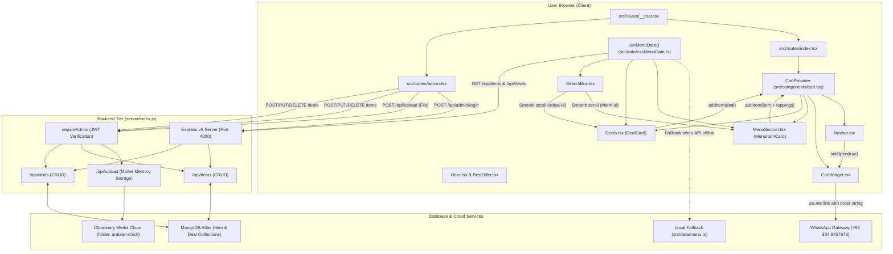

---

## 3. Frontend Interconnections & Wiring

### Tree Hierarchy & Component Relationships

```
<RootShell> (__root.tsx)
 └── <QueryClientProvider>
      └── <Index> (index.tsx)
           └── <CartProvider> (cart.tsx)
                ├── <Navbar>
                │    ├── <Logo />
                │    ├── <SearchBox />  ──[interconnects with]──> useMenuData & DOM anchors
                │    └── "Cart Button"   ──[triggers]───────────> CartProvider.setOpen(true)
                │
                ├── <main>
                │    ├── <Hero />
                │    ├── <BestOffer />
                │    ├── <MenuSection>  ──[consumes]───────────> useMenuData()
                │    │    └── <MenuItemCard>
                │    │         ├── <SmartImage /> ──[resolves]──> Cloudinary / Local / Fallback
                │    │         ├── Toppings Picker (Pizzas only)
                │    │         └── "Add to Order" ──[dispatches]─> CartProvider.addItem()
                │    │
                │    ├── <Deals>        ──[consumes]───────────> useMenuData()
                │    │    └── <DealCard>
                │    │         └── "Order Deal"   ──[dispatches]─> CartProvider.addItem()
                │    │
                │    ├── <DeliveryBanner />
                │    ├── <About />
                │    ├── <Gallery />
                │    └── <Contact />
                │
                ├── <Footer />
                └── <CartWidget>        ──[consumes]───────────> CartProvider
                     ├── Items List with Qty Controls (+ / - / delete)
                     ├── Live Total Calculation
                     ├── Payment Notice (Easypaisa / JazzCash)
                     └── "Send Order via WhatsApp" ──[dispatches]─> https://wa.me/923348457676
```

---

### The Cart State Bus (`CartContext`)

The `CartProvider` in [src/components/cart.tsx](file:///c:/Users/Hp/OneDrive/Desktop/All%20files/arabian-chicken/src/components/cart.tsx) acts as the **central state bus** for the customer checkout flow.

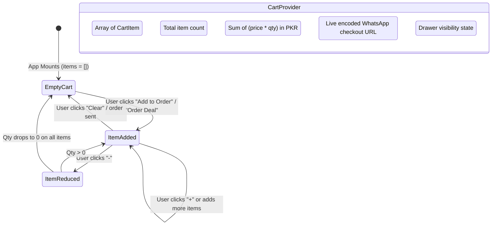

#### How Cart Context Connects Subsystems:
1. **Deduplication by Unique Key:**
   When an item is added, a unique composite key is passed:
   - For pizzas with toppings: `key = "${item.id}-${price.label}-${activeToppings.sort().join(',')}"`
   - For standard items: `key = "${item.id}-${price.label}"`
   - For deals: `key = "deal-${deal.id}"`
   If the exact combination already exists, `CartProvider` increments `qty` by 1 instead of duplicating the line.
2. **Navbar Counter Synchronization:**
   The `Navbar` subscribes to `count`. Whenever any item is added from the menu or deals, the cart badge automatically pulses and updates in real time.
3. **WhatsApp URL Construction:**
   The `whatsappUrl` is computed reactively via `useMemo` whenever `items` or `total` changes. It formats every line item, appends Pakistani Rupee currency formatting (`Rs.`), injects payment account details, and URL-encodes the string.

---

### The Data Ingestion Bus (`useMenuData`)

Defined in [src/data/useMenuData.ts](file:///c:/Users/Hp/OneDrive/Desktop/All%20files/arabian-chicken/src/data/useMenuData.ts).

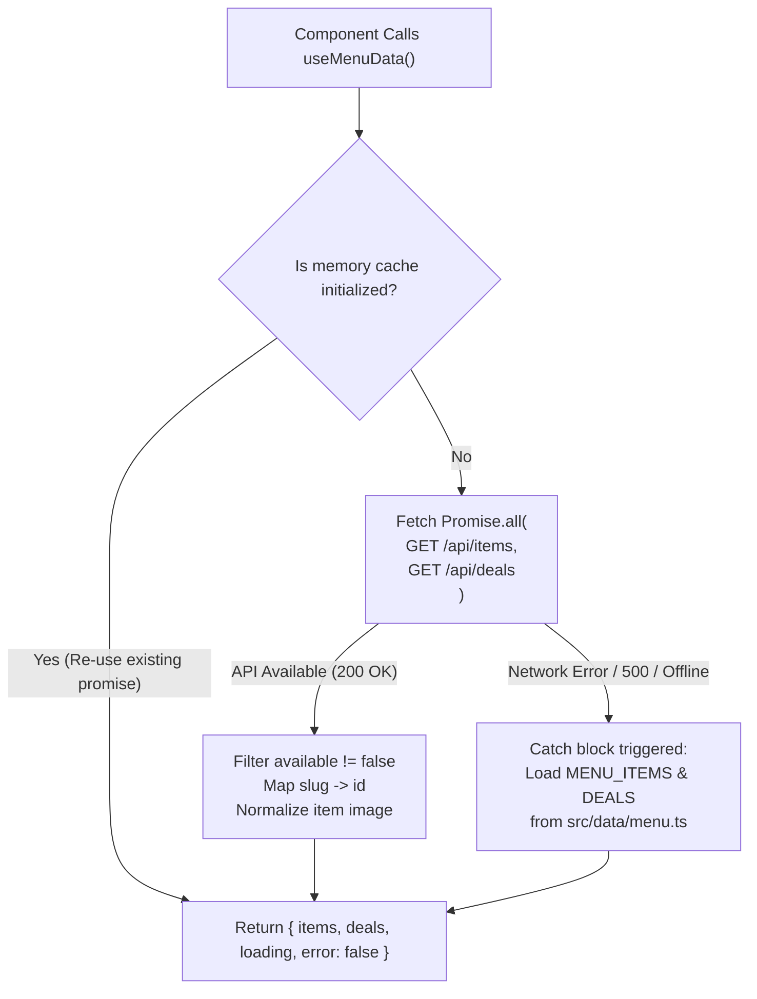

#### Key Interconnection Features:
- **Singleton Promise Caching:** The initial network request is saved in a module-level `cache` variable. Even if `MenuSection`, `Deals`, and `SearchBox` mount at the same time, only **one single network fetch** is made.
- **Fail-Safe Offline Operation:** If the Express backend is sleeping (e.g., Render free tier cold-starting) or offline, the promise catch block automatically serves the static menu dataset bundled in [src/data/menu.ts](file:///c:/Users/Hp/OneDrive/Desktop/All%20files/arabian-chicken/src/data/menu.ts). The user never sees a broken page.

---

### Search & Navigation Interconnection (`SearchBox` & Scrollspy)

The `SearchBox` in [src/components/SearchBox.tsx](file:///c:/Users/Hp/OneDrive/Desktop/All%20files/arabian-chicken/src/components/SearchBox.tsx) bridges user search queries directly with the page DOM:

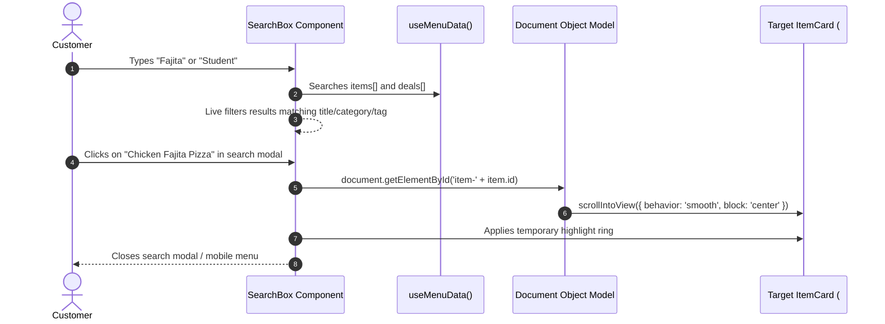

---

### Image Resolution Pipeline (`SmartImage`)

Images displayed in food cards are resolved through a hierarchical fallback chain implemented in [src/components/SmartImage.tsx](file:///c:/Users/Hp/OneDrive/Desktop/All%20files/arabian-chicken/src/components/SmartImage.tsx):

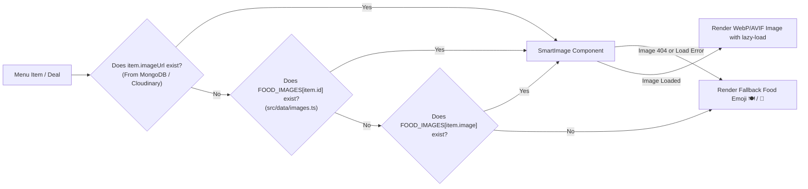

---

## 4. Backend & Database Interconnections

### Express Request Pipeline

Every incoming HTTP request traverses this ordered pipeline in [server/index.js](file:///c:/Users/Hp/OneDrive/Desktop/All%20files/arabian-chicken/server/index.js):

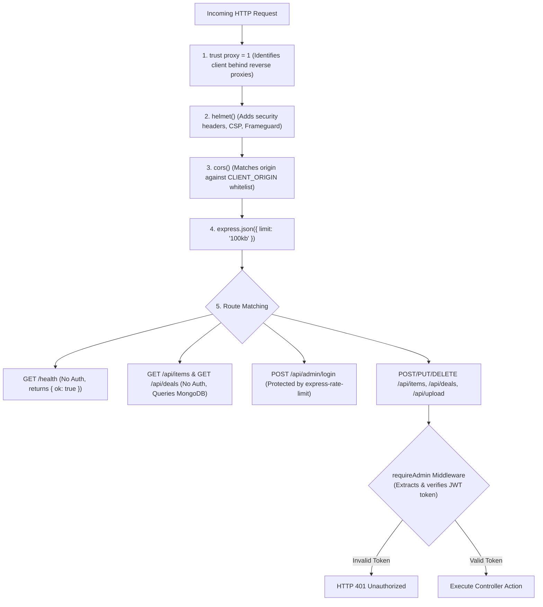

---

### Security & Authentication Interconnection

Admin login uses a **two-phase timing-safe verification**:

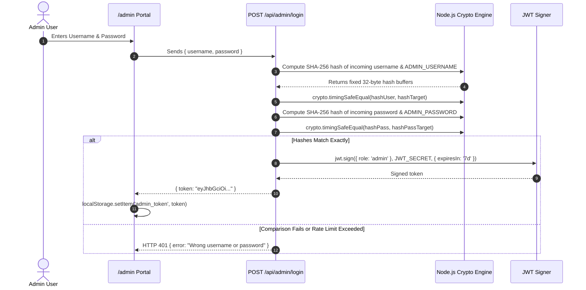

---

### Cloudinary Media Streaming Pipeline

When an administrator uploads an image in the admin panel, the file **never touches the server's hard drive**. It is streamed directly through memory:

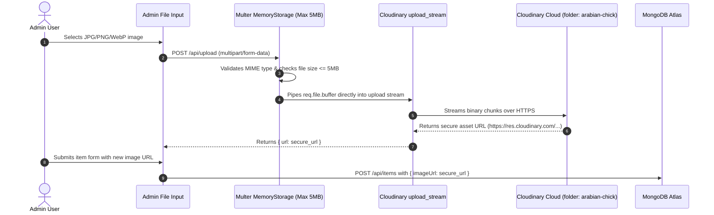

---

## 5. End-to-End Workflows (Step-by-Step Flow of Work)

### Workflow A: Storefront Landing & Resilient Hydration

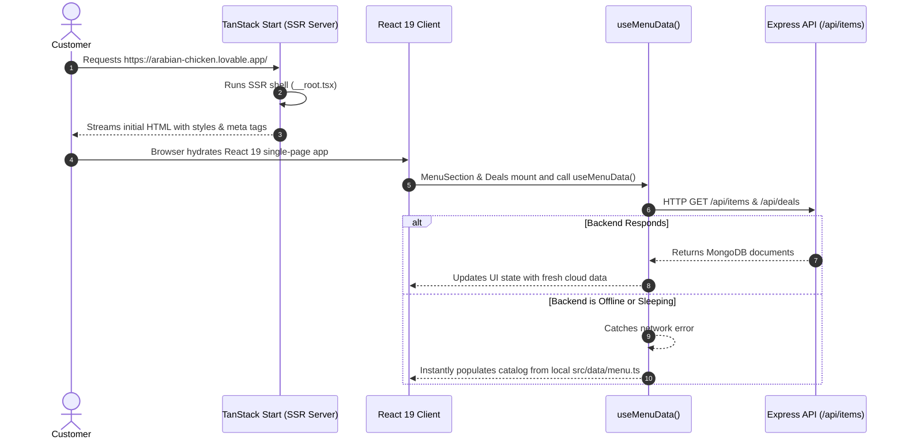

---

### Workflow B: Dynamic Pizza Sizing & Extra Toppings Customizer

Pizzas at Arabian Chick feature multi-tiered size pricing and size-dependent extra toppings (e.g., S: Rs.100, M: Rs.150, L: Rs.200, XL: Rs.300):

```mermaid
sequenceDiagram
    autonumber
    actor Customer as Customer
    participant Card as MenuItemCard (MenuSection.tsx)
    participant Helper as toppingPriceFor() (menu.ts)
    participant Cart as CartProvider (cart.tsx)

    Customer->>Card: Selects size: "M 10in" (Base price: Rs.1,050)
    Card->>Helper: toppingPriceFor("M 10in")
    Helper-->>Card: Returns Rs.150 per topping
    Customer->>Card: Checks "Extra Cheese" and "Mushrooms"
    Card->>Card: Active toppings count = 2
    Card->>Card: Calculates finalPrice = 1,050 + (2 × 150) = Rs.1,350
    Customer->>Card: Clicks "Add to Order"
    Card->>Cart: addItem({ key: "pizza-1-M 10in-Extra Cheese,Mushrooms", name: "Chicken Fajita Pizza", option: "M 10in (+Extra Cheese, +Mushrooms)", price: 1350 })
    Cart->>Cart: Item inserted into cart items list; count increments
```

---

### Workflow C: Order Assembly & Serverless WhatsApp Checkout

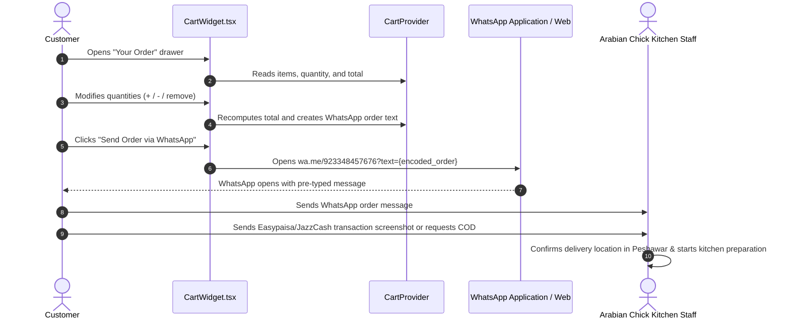

---

### Workflow D: Admin Authentication, Media Ingestion & Live Catalog Editing

```mermaid
sequenceDiagram
    autonumber
    actor Admin as Restaurant Manager
    participant AdminUI as /admin Portal
    participant API as Express API
    participant Cloudinary as Cloudinary CDN
    participant Mongo as MongoDB Atlas
    participant Storefront as Live Customer Storefront

    Admin->>AdminUI: Enters credentials -> Receives JWT
    Admin->>AdminUI: Clicks "+ Add New Item"
    Admin->>AdminUI: Chooses food photo
    AdminUI->>API: POST /api/upload (Multipart)
    API->>Cloudinary: Streams image buffer
    Cloudinary-->>API: Returns https://res.cloudinary.com/...
    API-->>AdminUI: Returns uploaded image URL
    Admin->>AdminUI: Fills name, category, prices, and clicks "Create Item"
    AdminUI->>API: POST /api/items (with JWT & Cloudinary URL)
    API->>Mongo: Item.create({ ...itemData })
    Mongo-->>API: Created record saved
    API-->>AdminUI: HTTP 200 OK
    AdminUI-->>Admin: Displays success toast; item appears in admin table
    Storefront->>API: Next customer fetch receives the new item immediately
```

---

### Workflow E: Database Seeding & Cloudinary Migration Batch

When initializing or resetting the database, the CLI script in [server/seed.js](file:///c:/Users/Hp/OneDrive/Desktop/All%20files/arabian-chicken/server/seed.js) executes the following sequence:

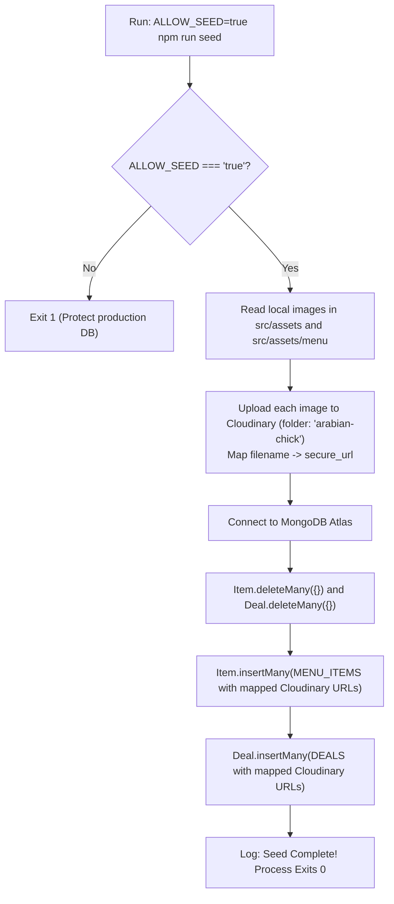

---

## 6. Data Payloads & Contracts Across Interconnected Nodes

### 1. Cart Item Schema (`CartItem`)
Transferred between `MenuItemCard` / `DealCard` -> `CartProvider` -> `CartWidget`:
```typescript
interface CartItem {
  key: string;       // Unique composite identifier (prevents duplicate collisions)
  name: string;      // e.g., "Chicken Fajita Pizza" or "Student Deal 1"
  option: string;    // e.g., "M 10in (+Extra Cheese)" or "Regular"
  price: number;     // Single unit price in PKR (including calculated toppings)
  qty: number;       // Quantity selected by the customer
}
```

### 2. WhatsApp Order Message String
Constructed in `CartProvider` and sent to `https://wa.me/923348457676`:
```text
Assalam-o-Alaikum! I would like to order:

• 1× Chicken Fajita Pizza (M 10in + Extra Cheese) — Rs.1,200
• 2× Zinger Burger (Single) — Rs.760

Total: Rs.1,960

Payment: Easypaisa / JazzCash - Tariq Mehmood (03151997888) / Shahid Mehmood (03459495524) or Cash on Delivery.
If I have paid online, I am sending the screenshot in this chat.
```

### 3. API Item Schema (Express -> MongoDB)
```json
{
  "_id": "67a1b2c3d4e5f6a7b8c9d0e1",
  "slug": "chicken-tikka-pizza-1712345678",
  "name": "Chicken Tikka Pizza",
  "category": "pizza",
  "group": "hot",
  "description": "Tender chicken tikka chunks with onions and special sauce",
  "tag": "Chef Special",
  "imageUrl": "https://res.cloudinary.com/dnxyz/image/upload/v1/arabian-chick/pizza-tikka.jpg",
  "prices": [
    { "label": "S 7in", "value": 550 },
    { "label": "M 10in", "value": 1050 },
    { "label": "L 13in", "value": 1550 },
    { "label": "XL 17in", "value": 2100 }
  ],
  "available": true,
  "order": 1,
  "createdAt": "2026-02-01T10:00:00.000Z",
  "updatedAt": "2026-02-01T10:00:00.000Z"
}
```

---

## 7. Failure Recovery & Resilient Fallback Flows

The system is designed with multiple fail-safe mechanisms so that customer-facing functionality remains operational even if third-party services fail:

| Potential Failure Point | Interconnected Fallback Strategy | User Impact |
| :--- | :--- | :--- |
| **Backend API Downtime** | `useMenuData()` catches the fetch exception and loads `src/data/menu.ts` static constants | Zero downtime. Customers can browse and order normally. |
| **Image CDN 404 / Network Drop** | `SmartImage` detects `onError` and displays an emoji fallback (`🍽️` or `🍕`) | Layout never breaks; missing images show friendly icons. |
| **Catastrophic SSR Server Error** | `src/server.ts` & `src/start.ts` intercept uncaught exceptions and render a clean static HTML error page | Prevents raw JSON dumps or server stack traces from leaking. |
| **Admin Route Brute-Force Attack** | `express-rate-limit` blocks IPs exceeding 10 attempts per 15 minutes | Protects admin credentials and server resources. |
| **Timing Attacks on Admin Password** | `crypto.timingSafeEqual` hashes inputs before comparing in constant time | Immune to statistical timing analysis attacks. |

---
*Created for **Arabian Chick, N** — Peshawar, Pakistan.*
